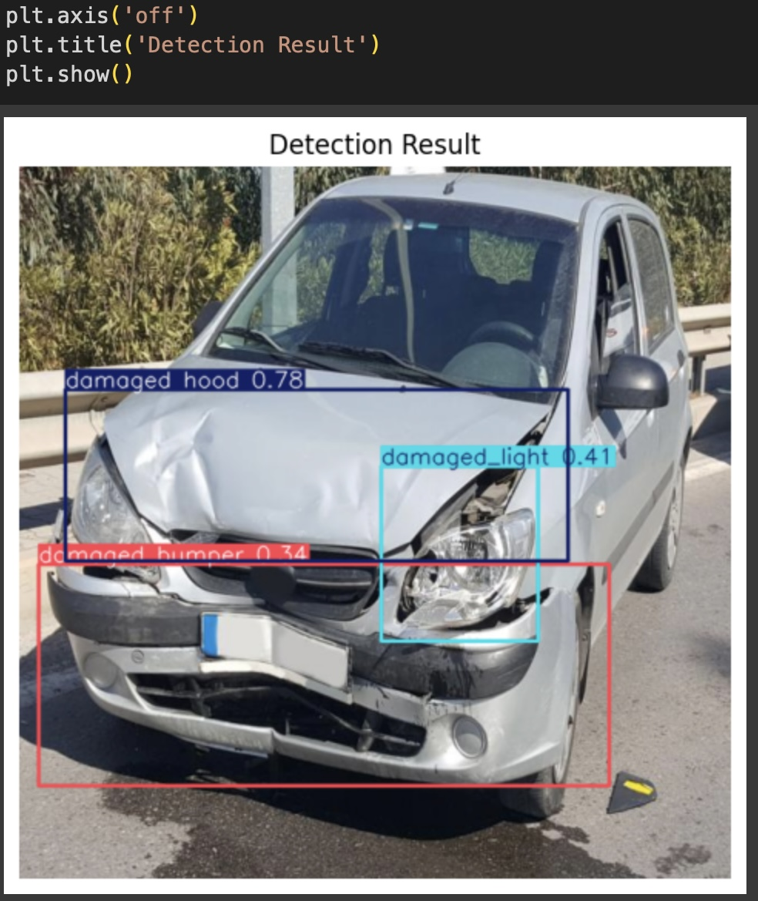
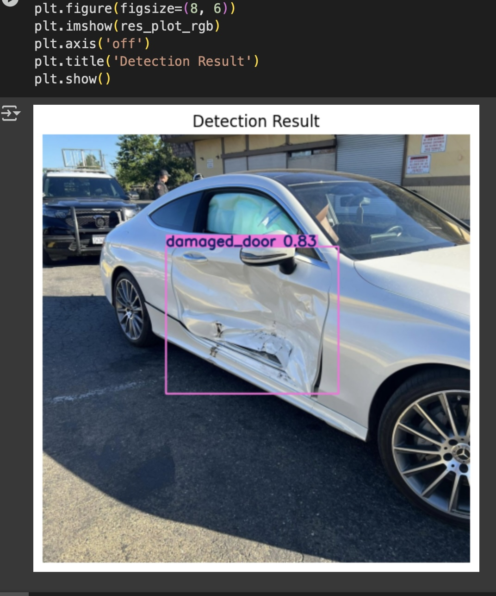

#  Car Damage Detection using YOLOv8 🚗

A computer vision project that detects various types of external car damage (scratches, dents, broken lights, etc.) using the state-of-the-art **YOLOv8** object detection model.

---

##  Project Overview

This project uses deep learning (**YOLOv8**) to:

- Detect and localize damage on vehicles
- Classify different damage types (e.g. dent, scratch, broken window)
- Provide fast and accurate predictions for automotive assessments and insurance automation

---

##  Tech Stack 🛠️

| Component     | Description                                                                 |
|---------------|-----------------------------------------------------------------------------|
| `YOLOv8`      | Object detection model from [Ultralytics](https://github.com/ultralytics/ultralytics) |
| `Python 3.10+`| Programming language                                                        |
| `OpenCV`      | Image processing library                                                    |
| `PyTorch`     | Deep learning engine                                                        |
| `LabelImg`    | Tool for manual annotations (YOLO format)                                   |

---

## 📁 Dataset Structure

The dataset should follow this structure:
datasets/car_damage/
├── images/
│   ├── train/
│   │   ├── image1.jpg
│   │   ├── image2.jpg
│   │   └── ...
│   └── val/
│       ├── imageX.jpg
│       └── ...
├── labels/
│   ├── train/
│   │   ├── image1.txt
│   │   ├── image2.txt
│   │   └── ...
│   └── val/
│       ├── imageX.txt
│       └── ...

## Model Performance 📈

| Class            | Images | Instances | Precision | Recall | mAP@0.5 | mAP@0.5:0.95 |
|------------------|--------|-----------|-----------|--------|---------|--------------|
| **All classes**        | 355    | 478       | **0.971**    | **0.990** | **0.993**  | **0.909**     |
| Scratches         | 61     | 90        | 0.972     | 0.967  | 0.993   | 0.865        |
| Damaged Light     | 47     | 50        | 0.943     | 0.989  | 0.988   | 0.891        |
| Dent              | 97     | 104       | 0.945     | 0.986  | 0.992   | 0.870        |
| Damaged Window    | 32     | 33        | 0.978     | 1.000  | 0.995   | 0.974        |
| Damaged Hood      | 46     | 46        | 0.998     | 1.000  | 0.995   | 0.920        |
| Damaged Door      | 31     | 34        | 0.992     | 1.000  | 0.995   | 0.937        |
| Damaged Bumper    | 116    | 121       | 0.968     | 0.986  | 0.994   | 0.906        |

##  Detection Examples 📸

Below are some examples of detected car damages using the trained YOLOv8 model:

| Output Sample 1            | Output Sample 2            |
|----------------------------|----------------------------|
|              |              |

